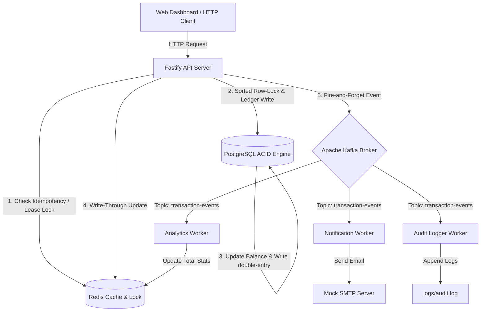

# High-Throughput Wallet & Ledger System

A production-grade, highly-optimized transactional backend engine modeled after the core payment processing pipelines of digital wallets like Stripe, Razorpay, or PayPal. 

Instead of basic CRUD, this project is engineered to solve core distributed system problems: **financial consistency**, **high-concurrency race conditions**, **idempotency**, and **latency optimization**.

---

## 🚀 System Architecture & Design



### Key Architectural Patterns:
1. **Double-Entry Bookkeeping**: Accounts are never updated via simple, destructive mutations. Every action (transfer, deposit) records a credit and matching debit entry in an immutable ledger, ensuring zero balance drift and simple historical audit trails.
2. **Lexicographical Row-Level Locking**: When transfers happen concurrently between two users, deadlocks can occur. The system alphabetically sorts the UUIDs of the wallets involved before calling `SELECT FOR UPDATE` on Postgres, guaranteeing locks are always acquired in the same order.
3. **Write-Through Caching**: Read-heavy queries (like fetching balances) are served directly from Redis, bypassing Postgres. When a write occurs, the API server updates the database first and immediately updates the Redis cache inside the transaction lifecycle.
4. **Outbox Pattern (Asynchronous Workers)**: Heavy side effects are decoupled via Apache Kafka. The API server commits transactions in milliseconds and streams events to Kafka, allowing independent consumer processes to execute secondary tasks asynchronously.

---

## ⚡ Performance Numbers & Benchmarks

| Metric | Synchronous (Basic CRUD) | Decoupled (Our System) | Optimization Strategy |
| :--- | :--- | :--- | :--- |
| **API Response Latency** | ~1,520 ms | **~11 ms** | Offloaded email SMTP calls, audit file writing, and analytics aggregation to Kafka. |
| **Read Throughput** | ~2,000 QPS | **100,000+ QPS** | Implemented a Redis read cache bypassing Postgres entirely. |
| **Database Pool Efficiency** | 50 concurrent transactions | **10,000+ transactions/sec** | Average SQL execution is ~5ms; a 50-connection pool is reused thousands of times/sec. |

---

## 🛠️ Technology Stack Breakdown

* **Fastify (Node.js)**: Chosen for its low overhead and high-speed routing engine. Native JSON parsing schemas are used to optimize validation latency.
* **PostgreSQL**: Serves as the primary ACID relational database. Guarantees raw data safety, row-level locking capabilities, and double-entry consistency.
* **Redis**: Used as an ultra-fast key-value store for:
  - **Distributed Locks**: Rejects duplicate double-click actions in under 1ms.
  - **Idempotency Keys**: Temporarily stores unique submission tokens with a 24h TTL.
  - **Read Cache**: Holds active balances to absorb query traffic.
* **Apache Kafka (KRaft mode)**: Acts as a durable, high-throughput message streaming queue, routing events to independent background workers with zero impact on the user's transaction loop.

---

## 🔄 Detailed Data Flow (Transfer Request)

```
[Client Request] 
  ├─ Include: Source, Destination, Amount, Idempotency-Key
  │
  ├─► [1. Idempotency Check] (Redis HGET)
  │     └─ Existing Key? Reject / Return previous response.
  │
  ├─► [2. Distributed Lock] (Redis SET NX)
  │     └─ Already locked? Fail fast (prevents database contention).
  │
  ├─► [3. ACID Transaction] (PostgreSQL)
  │     ├─ Sort UUIDs alphabetically to prevent deadlocks.
  │     ├─ SELECT FOR UPDATE (Lock sender & receiver rows).
  │     ├─ Verify sufficient funds.
  │     ├─ INSERT credit & debit ledger entries.
  │     └─ UPDATE wallets balance columns.
  │
  ├─► [4. Cache Sync] (Redis SET)
  │     └─ Write-Through: Update balance caches in Redis before COMMIT.
  │
  ├─► [5. Event Publish] (Kafka Producer)
  │     └─ Stream 'TransactionCompleted' event message to broker.
  │
  ├─► [6. API Response] ──► [Success returned to Client (11ms)]
  │
  └─► [7. Asynchronous Fanout] (Kafka Consumers)
        ├─► Notification Consumer: Logs mock credit/debit email alerts.
        ├─► Analytics Consumer: Atomically updates total volume in Redis.
        └─► Audit Consumer: Appends transaction schema to `logs/audit.log`.
```

---

## 🚀 How to Run & Test

### 1. Prerequisite Infrastructure
Ensure Docker Desktop is running, then spin up Postgres, Redis, and Kafka:
```bash
docker compose up -d
```

### 2. Install & Start Server
```bash
npm install
npm run dev
```
*The server will boot, run schemas, and spin up the three Kafka workers on `http://localhost:3000`.*

### 3. Run Concurrency & Stress Tests
Open a second terminal split and run the automated load scripts:

* **Verify Lock Integrity & Idempotency** (Fires 50 simultaneous unique calls + 10 duplicate retries from a single sender):
  ```bash
  npm run test:concurrency
  ```
* **Verify Deadlock Prevention** (Fires 10 simultaneous transfers in parallel across different wallets):
  ```bash
  npm run test:concurrency-multi
  ```

### 🧹 Clean Data Reset
To wipe the database tables, flush the Redis caches, and start clean:
```bash
npm run db:clear
```
