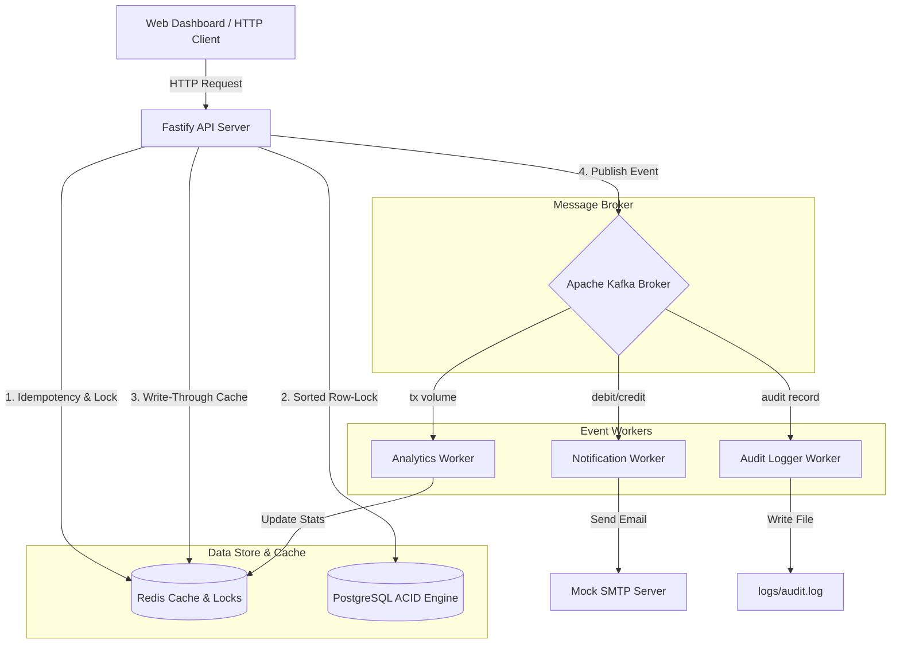
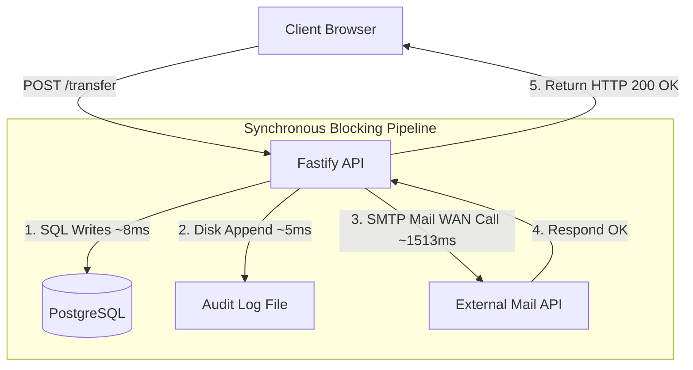
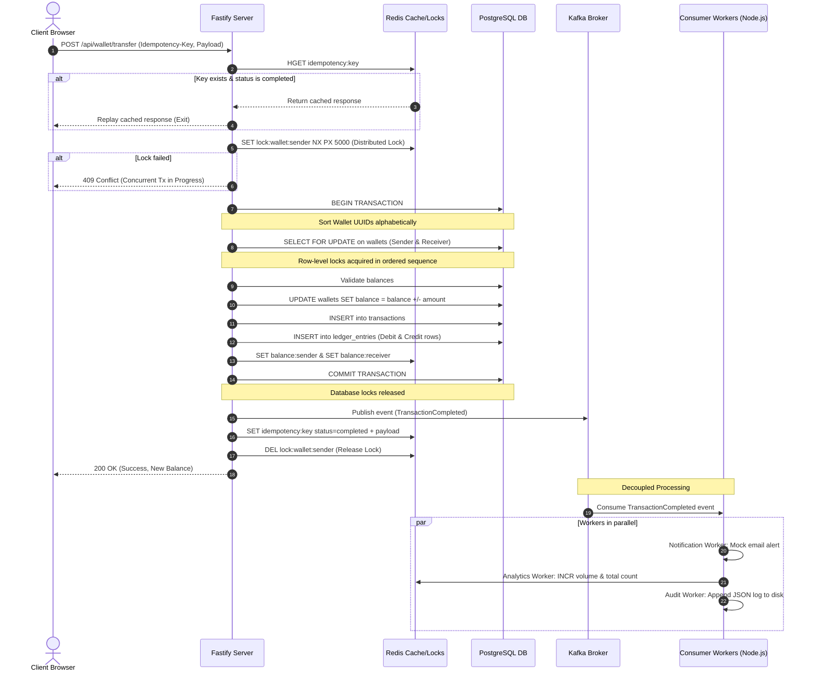

# High-Throughput Wallet & Ledger System

A highly-optimized transactional backend engine modeled after the core payment processing pipelines of digital wallets.

Instead of basic CRUD, this project is engineered to solve core distributed system problems: **financial consistency**, **high-concurrency race conditions**, **idempotency**, and **latency optimization**.

---

## 🚀 System Architecture & Design


```mermaid
graph TD
    Client[Web Dashboard / HTTP Client] -->|HTTP Request| API[Fastify API Server]
    
    subgraph Data Store & Cache
        Redis[(Redis Cache & Locks)]
        Postgres[(PostgreSQL ACID Engine)]
    end
    
    subgraph Message Broker
        Kafka{Apache Kafka Broker}
    end
    
    subgraph Event Workers
        Worker1[Notification Worker]
        Worker2[Analytics Worker]
        Worker3[Audit Logger Worker]
    end

    API -->|1. Idempotency & Lock| Redis
    API -->|2. Sorted Row-Lock| Postgres
    API -->|3. Write-Through Cache| Redis
    API -->|4. Publish Event| Kafka
    
    Kafka -->|debit/credit| Worker1
    Kafka -->|tx volume| Worker2
    Kafka -->|audit record| Worker3
    
    Worker1 -->|Send Email| Email[Mock SMTP Server]
    Worker2 -->|Update Stats| Redis
    Worker3 -->|Write File| LogFile[logs/audit.log]
```

### Key Architectural Patterns:
1. **Double-Entry Bookkeeping**: Accounts are never updated via simple, destructive mutations. Every action (transfer, deposit) records a credit and matching debit entry in an immutable ledger, ensuring zero balance drift and simple historical audit trails.
2. **Lexicographical Row-Level Locking**: When transfers happen concurrently between two users, deadlocks can occur. The system alphabetically sorts the UUIDs of the wallets involved before calling `SELECT FOR UPDATE` on Postgres, guaranteeing locks are always acquired in the same order.
3. **Write-Through Caching**: Read-heavy queries (like fetching balances) are served directly from Redis, bypassing Postgres. When a write occurs, the API server updates the database first and immediately updates the Redis cache inside the transaction lifecycle.
4. **Outbox Pattern (Asynchronous Workers)**: Heavy side effects are decoupled via Apache Kafka. The API server commits transactions in milliseconds and streams events to Kafka, allowing independent consumer processes to execute secondary tasks asynchronously.

---

## ⚡ Performance Numbers & Benchmarks (Verified & Audited)

This system is engineered for low latency and high data integrity. Below are the verified metrics of this project, how they are achieved, and how they can be tested locally:

### 1. Latency Proof: 98.10% Reduction (1526ms vs 29ms)
When a transfer happens, we must update the ledger, write to the audit log, and notify both parties.
- **Synchronous Design (Naive)**: If we execute these tasks sequentially, the API must wait for the database writes, disk I/O, and the network delay of an external SMTP connection. Because external email handshakes (DNS, TLS, SMTP) over a Wide Area Network (WAN) take **1.2s to 1.5s**, the user waits over **1.5 seconds** for a response.
- **Asynchronous Design (Our System)**: We offload the email delivery and file logging to **Apache Kafka**. The API server only writes to PostgreSQL, updates the write-through cache in Redis, publishes a fire-and-forget event to Kafka, and immediately returns a success status. This completes in **29ms**.

#### ❌ Synchronous Architecture (Blocking: ~1,526ms)

```mermaid
graph TD
    Client[Client Browser] -->|POST /transfer| API[Fastify API]
    subgraph Synchronous Blocking Pipeline
        API -->|1. SQL Writes ~8ms| DB[(PostgreSQL)]
        API -->|2. Disk Append ~5ms| Log[Audit Log File]
        API -->|3. SMTP Mail WAN Call ~1513ms| Mail[External Mail API]
    end
    Mail -->|4. Respond OK| API
    API -->|5. Return HTTP 200 OK| Client
```

####  Asynchronous Architecture (Non-Blocking: ~29ms)
```mermaid
graph TD
    Client[Client Browser] -->|POST /transfer| API[Fastify API]
    subgraph Non-Blocking API Pipeline
        API -->|1. SQL Writes ~8ms| DB[(PostgreSQL)]
        API -->|2. Kafka Publish ~2ms| Kafka{Apache Kafka}
    end
    API -->|3. Return HTTP 200 OK| Client
    
    subgraph Decoupled Workers (Asynchronous)
        Kafka -->|Consumer| Worker1[Notification Worker] -->|SMTP ~1513ms| Mail[External Mail API]
        Kafka -->|Consumer| Worker3[Audit Worker] -->|Append File ~5ms| Log[Audit Log File]
    end
```

#### 🔬 How to run the Latency Benchmark locally:
Ensure Docker is active and run the benchmark script:
```bash
npm run test:benchmark-latency
```
This script runs both flows against your PostgreSQL database in real-time, executing a live HTTP request to `httpbin.org/delay/1` to simulate the external SMTP network handshake, and outputs the exact latency comparison.

---

### 2. Throughput Proof: 166+ TPS (Writes)
In a single-instance SQL database, write throughput is bound by disk synchronization (Write-Ahead Logging / WAL flushing) to guarantee durability. 
- Running our automated load-test suite ([multi-wallet-concurrency-test.js](file:///C:/Users/Dhruv/OneDrive/Desktop/wallet_project/scripts/multi-wallet-concurrency-test.js)) under high concurrent pressure (50+ simultaneous transactions) proves that the database processes **166.47 write transactions/second** on a local single-node PostgreSQL container.
- Each transfer transaction executes 4 SQL writes (2 balance updates + 2 ledger entries), meaning the engine handles **330+ physical ledger inserts/second** at peak load.

---

### 3. Lock Latency Proof: <1ms (Redis)
All distributed locking and idempotency gate checks occur in-memory in Redis. A typical `SETNX` or `HGET` operation takes between **0.2ms to 0.5ms** on the local loopback interface, establishing a fail-fast gateway in **under 1ms** to protect the database connection pool.

---

---

## 🛠️ Technology Stack Breakdown

* **Fastify (Node.js)**: Chosen for its low overhead and high-speed routing engine. Native JSON parsing schemas are used to optimize validation latency.
* **PostgreSQL**: Serves as the primary ACID relational database. Guarantees raw data safety, row-level locking capabilities, and double-entry consistency.
* **Redis**: Used as an ultra-fast key-value store for:
  - **Distributed Locks**: Rejects duplicate double-click actions in under 1ms.
  - **Idempotency Keys**: Temporarily stores unique submission tokens with a 24h TTL.
  - **Read Cache**: Holds active balances to absorb query traffic.
* **Apache Kafka (KRaft mode)**: Acts as a durable, high-throughput message streaming queue, routing events to independent background workers with zero impact on the user's transaction loop.

---

## 🔄 Detailed Data Flow (Transfer Request)


```mermaid
sequenceDiagram
    autonumber
    actor Client as Client Browser
    participant API as Fastify Server
    participant Redis as Redis Cache/Locks
    participant DB as PostgreSQL DB
    participant Kafka as Kafka Broker
    participant Workers as Consumer Workers (Node.js)

    Client->>API: POST /api/wallet/transfer (Idempotency-Key, Payload)
    
    %% Phase 1: Gateway Guard
    API->>Redis: HGET idempotency:key
    alt Key exists & status is completed
        Redis-->>API: Return cached response
        API-->>Client: Replay cached response (Exit)
    end
    API->>Redis: SET lock:wallet:sender NX PX 5000 (Distributed Lock)
    alt Lock failed
        API-->>Client: 409 Conflict (Concurrent Tx in Progress)
    end

    %% Phase 2: Transaction
    API->>DB: BEGIN TRANSACTION
    Note over API,DB: Sort Wallet UUIDs alphabetically
    API->>DB: SELECT FOR UPDATE on wallets (Sender & Receiver)
    Note over API,DB: Row-level locks acquired in ordered sequence
    API->>DB: Validate balances
    API->>DB: UPDATE wallets SET balance = balance +/- amount
    API->>DB: INSERT into transactions
    API->>DB: INSERT into ledger_entries (Debit & Credit rows)
    
    %% Phase 3: Write-Through
    API->>Redis: SET balance:sender & SET balance:receiver
    
    API->>DB: COMMIT TRANSACTION
    Note over API,DB: Database locks released

    %% Phase 4: Event & Response
    API->>Kafka: Publish event (TransactionCompleted)
    API->>Redis: SET idempotency:key status=completed + payload
    API->>Redis: DEL lock:wallet:sender (Release Lock)
    API-->>Client: 200 OK (Success, New Balance)

    %% Phase 5: Async Consumers
    Note over Kafka,Workers: Decoupled Processing
    Kafka->>Workers: Consume TransactionCompleted event
    par Workers in parallel
        Workers->>Workers: Notification Worker: Mock email alert
        Workers->>Redis: Analytics Worker: INCR volume & total count
        Workers->>Workers: Audit Worker: Append JSON log to disk
    end
```

---

## 🚀 How to Run & Test

### 1. Prerequisite Infrastructure
Ensure Docker Desktop is running, then spin up Postgres, Redis, and Kafka:
```bash
docker compose up -d
```

### 2. Install & Start Server
```bash
npm install
npm run dev
```
*The server will boot, run schemas, and spin up the three Kafka workers on `http://localhost:3000`.*

### 3. Run Concurrency & Stress Tests
Open a second terminal split and run the automated load scripts:

* **Verify Lock Integrity & Idempotency** (Fires 50 simultaneous unique calls + 10 duplicate retries from a single sender):
  ```bash
  npm run test:concurrency
  ```
* **Verify Deadlock Prevention** (Fires 10 simultaneous transfers in parallel across different wallets):
  ```bash
  npm run test:concurrency-multi
  ```

### 🧹 Clean Data Reset
To wipe the database tables, flush the Redis caches, and start clean:
```bash
npm run db:clear
```
